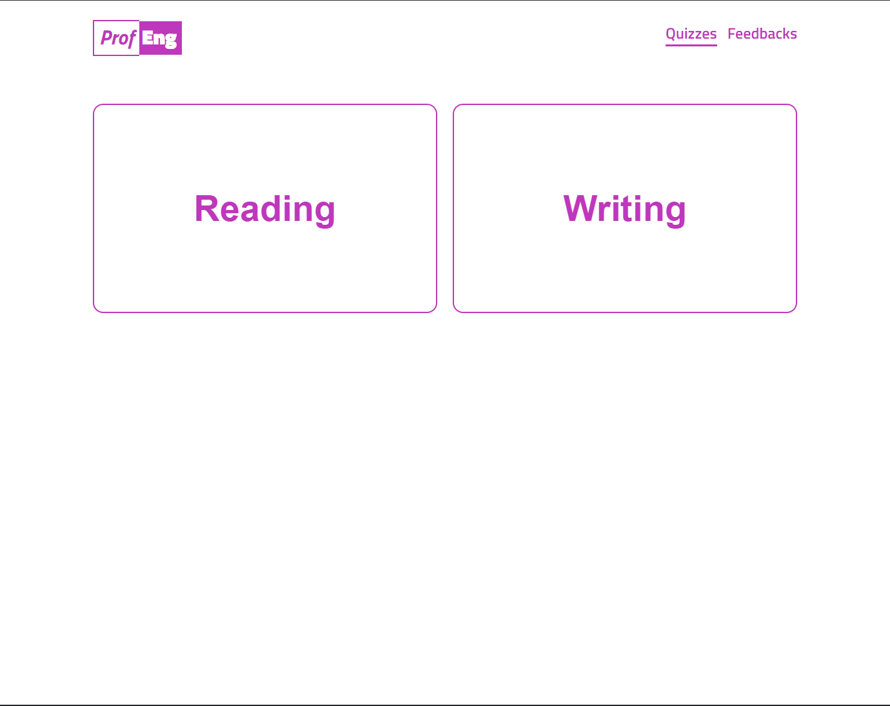
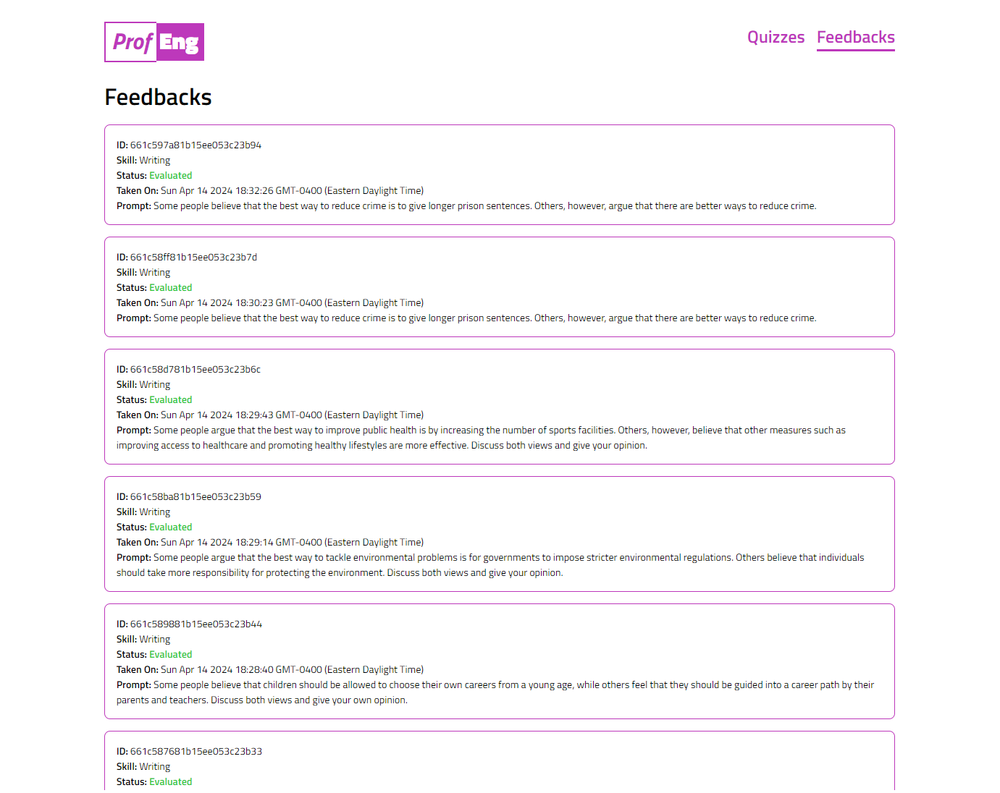
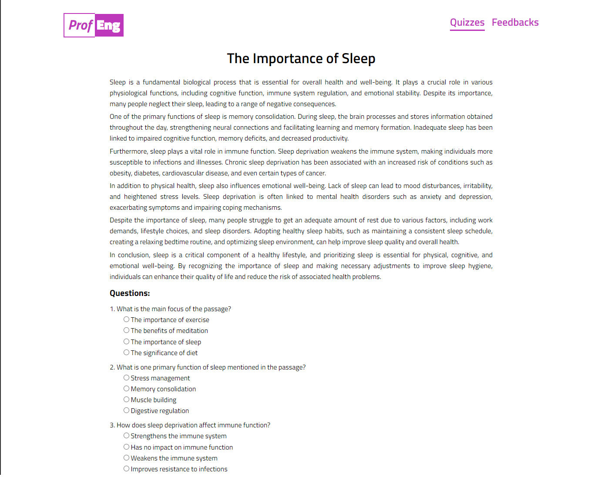
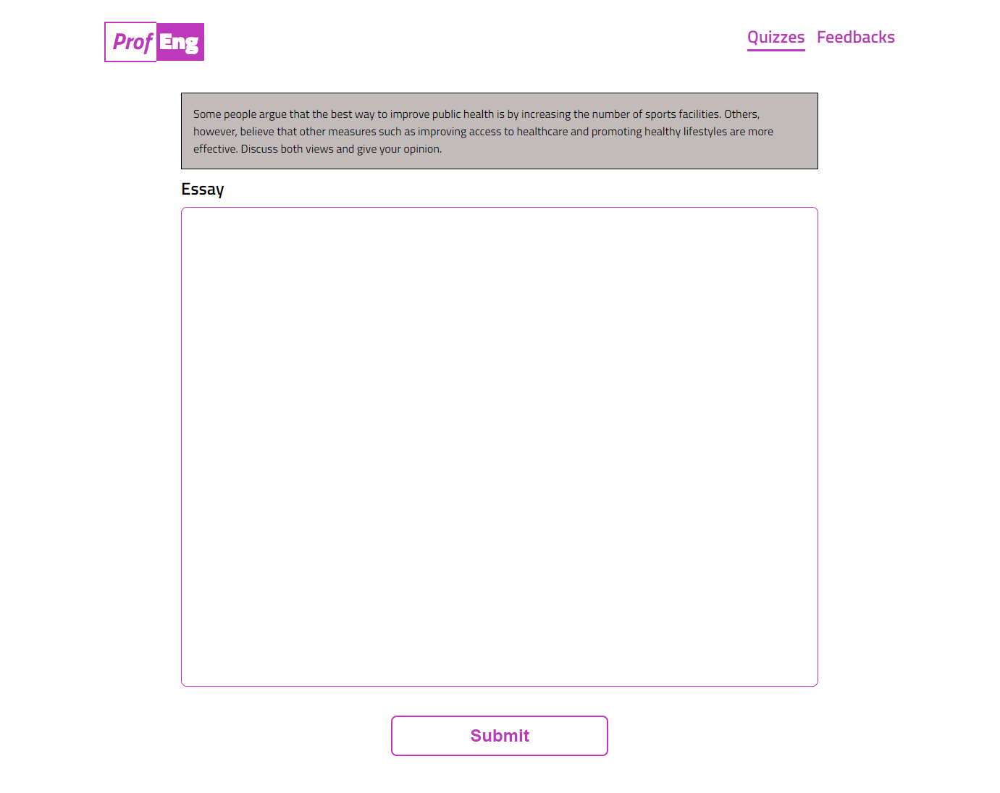
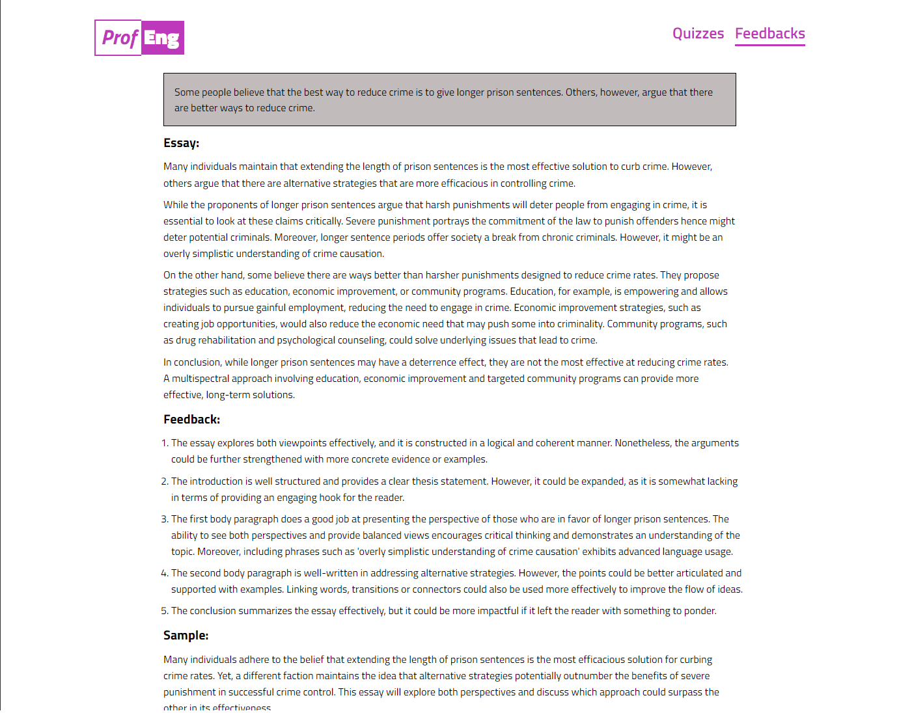
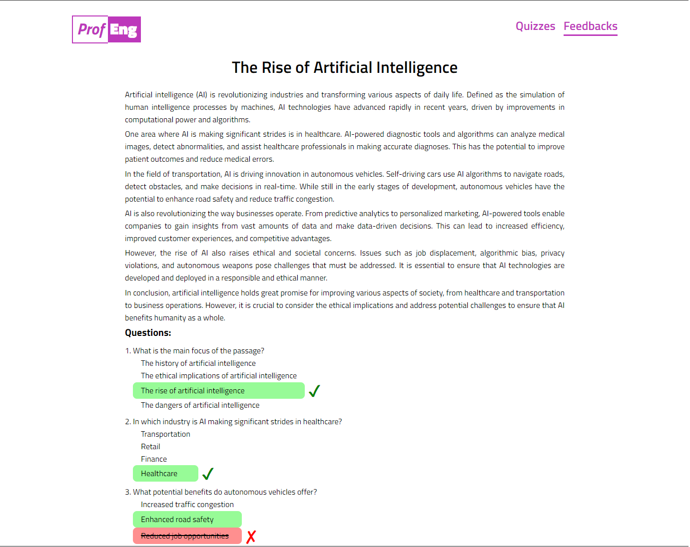

# Project Title
ProfEng(Proficient English)

- [Overview](#overview)
    - [Problem](#problem)
    - [User Profile](#user-profile)
    - [Feature](#feature)
- [Implementation](#implementation)
    - [Tech Stack](#tech-stack)
    - [APIs](#apis)
    - [Sitemap](#sitemap)
    - [Mockups](#mockups)
- [Nice to Have](#nice-to-haves)
- [Installation](#installation)

## Overview

ProfEng is a web application that aims to increase the English Proficiency of users.
It leverages the power of AI through ChatGPT to provide real-time feedback empowering users to enhance their proficiency in English effectively and confidently.

### Problem

Many individuals struggle to achieve proficiency in the English language due to limited access to quality resources and personalized learning experiences. This results in difficulties in communication, education, and career advancement. 'ProfEng' aims to address this challenge by providing an innovative platform that leverages the power of AI through ChatGPT to provide users a personalized learning experience, empowering users to enhance their proficiency in English effectively and confidently.

### User Profile

- Individuals of all ages and proficiency levels who are seeking to improve their English language  skills for personal, academic, or professional reasons.

- Students preparing for standardized English language exams (e.g., TOEFL, IELTS) or studying in English-medium schools or universities who require additional support in language acquisition.

- Working professionals who need to enhance their English proficiency for career advancement, job opportunities, or effective communication in multicultural workplaces.

- Individuals living in English-speaking countries who are looking to improve their language skills to better integrate into society, access employment opportunities, or pursue further education.

### Features

- As a user, I want to be able to test my reading comprehension.
- As a user, I want to be able to test my essay writing skill.
- As a user, I want to be able to see a list of all my taken test.
- As a user, I want to be able to view the details of the reading test I have taken
- As a user, I want to be able to view the details of the writing test I have taken

## Implementation

### Tech Stack

List technologies that will be used in your app, including any libraries to save time or provide more functionality. Be sure to research any potential limitations.

Stack

- Nodejs
- Expressjs
- MongoDB
- NextJS

Client Libraries:
- create-next-app
- axios

Server Libraries:
- mongoose
- axios
- express
- openai

Others:
- Typescript

### APIs

[OpenAI](https://platform.openai.com/docs/api-reference/chat)

### Sitemap

- Quiz
- Feedbacks
- Reading Feedback
- Writing Feedback
- Reading Test
- Writing Test

### Mockups

#### Login Page

#### Signup Page

#### Reading Page

#### Writing Page

### Feedbacks Page

### Feedback Page

### Data

### ER Diagram

### Endpoints

**GET /api/v1/reading/**
    - returns a random reading id

**GET /api/v1/reading/:id**
    - returns a reading template

**GET /api/v1/writing/**
    - returns a random writing id

**GET /api/v1/writing/:id**
    - returns a writing template

**GET /api/v1/feedback/**
    - returns all feedback

**GET /api/v1/feedback/writing/:id**
    - returns a single writing feedback

**GET /api/v1/feedback/reading/:id**
    - returns a single reading feedback

**POST /api/v1/feedback/reading**
    - post a reading feedback to the database

**POST /api/v1/feedback/writing**
    - post a writing feedback to the database

### Auth

## Roadmap

- Familiarize OpenAI API
- Create Server
    - Install Node dependencies
    - Establish connection to MongoDB
- Create Client
    - Install Next dependencies
- Feature: Writing
    - Create Writing Page
    - Get Writing Prompts
- Feature: Reading
    - Create Reading Page
    - Get Reading Questions
- Feature: Test List
    - Create Tests Page
    - Get List of Tets taken
- Feature: Test Details
    - Create Details Page
    - Get Single Test with Details
- Bug Fixes
- Demo Day

## Nice-to-haves

- Feature: Listening Page
    - Will be able to assess listening comprehension
- Feature: Speaking
    - Will be able to have a conversation with OpenAI
- Feature: Login Page
    - Use OAuth or Passport for Authentication and Authorization
- Feature: Sort and Filter
    - Will be able to sort and filter feedbacks

## Installation
- Set Environmental Variables
- `npm install`
- `npm run dev'